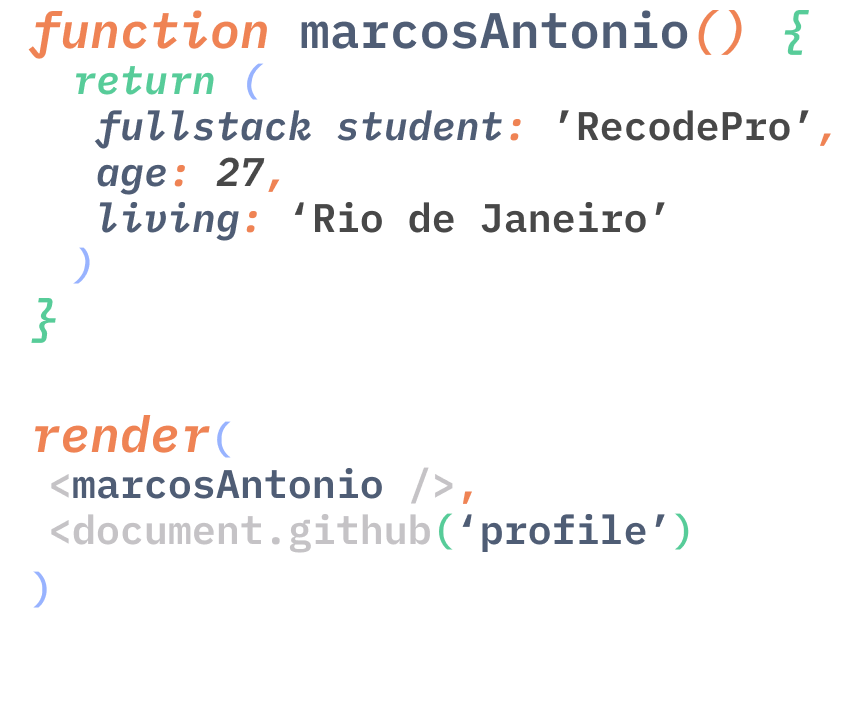

---
 

## Hi there :wave: :wave:

### Aluno do curso Full Stack da Recode.
**Você pode saber mais sobre, nesse [repositório](https://github.com/arcmarcos/RecodePro2020).**

**Veja também esse [repositório](https://github.com/arcmarcos/OneSiteDay).** ~~Onde tento fazer um site (ou elementos de um) quase todo dia.~~ 
> Projeto tá parado, mas é por um bom motivo! Estou focando meu tempo em estudar as tecnologias ensinadas no curso da Recode.
 

---

---

 
